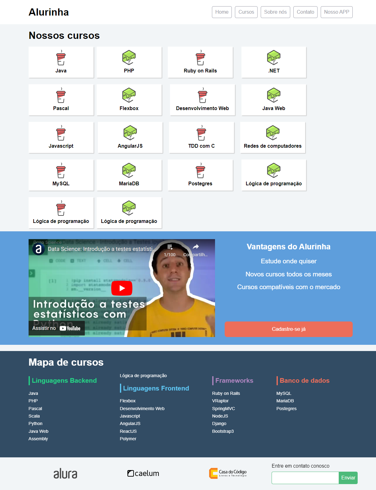
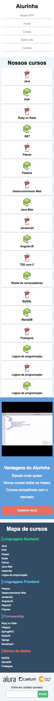

# <h1 align="center">AlurinhaCursosOnline</h1>

<h2 align="center"> Imagem da página Desktop </h2>
 

 

<h2 align="center"> Imagem da página Mobile </h2>
 

 

<h2 align="center"> Descrição do Projeto </h2>
 
    Criação do site Alurinha para venda de cursos online. 
    Projeto desenvolvido para demonstrar os conhecimentos adquiridos no curso "Flexbox: posicione elementos na tela", presente no site na Alura.
 

<h2 align="center"> :hammer:  Ferramentas e Funcionalidades  :hammer: </h2>
 

 
          
<h2 align="center"> :notebook:  O que Aprendi  :notebook:</h2>

 - Elaboração de um site responsivo com Flexbox
 - Posicionamento de elementos na página com flexbox
 - Utilização de diversas propriedades do Flexbox que substituem o float, inline e inline-box

 
 
<h2 align="center"> :heart:  Contato  :heart:</h2>
 

regothardo@gmail.com
